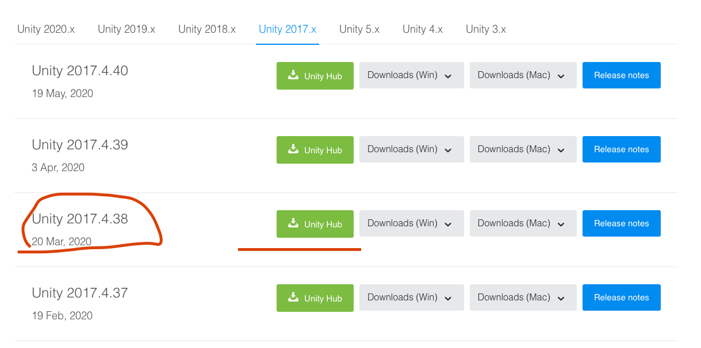

# A Random Act: Generative Graphics
## Description
A Random Act is a production set for release in Spring 2022 that will take advantage of generative graphics to simulate the effects of a drug called FTS. This repository stores all the files and code for the development of the Generative Graphics engine to create all the effects needed for the production of this play. 

## Requirements
### Hardware
Windows 10 Machine
Intel Real Sense Depth Camera D435

### Software
Unity Hub 
Unity Version 2017.4.38 
Nuitrack 

## Installation Instructions
### Nuitrack and Depth Camera Set-up

Download NuiTrack [here](http://download.3divi.com/Nuitrack/doc/Installation_page.html). Ensure you're downloading the appropiate version depending on your Windows version (32-bit or 64-bit)

NOTE: NuiTrack requires that you have C++ installed, if you don't have it already installed, just follow step 3 in the Nuitrack download link 

Once Nuitrack has successfully downloaded, plug in the Depth camera to your PC to prepare for activation. 

Run the Nuitrack executable, either by searching it in your available programs or locating your Nuitrack download and running the Nuitrack.exe file. 

NOTE: The first time you run Nuitrack it may perform a compatibility test. This is normal. Wait for it to finish with the camera plugged in. 

You should see a screen like the one below. Select the depth camera (must be plugged in) from the drop-down menu and enter the activation key. **To get the activation key, you must log in [here](https://cognitive.3divi.com/app/login/) with the credentials provided by Clay. Instructions to log in will also be in the shared google drive folder you will get from him**

Once the license has been activated, test that the camera works as expected by clicking the 'Test' button next to the camera drop-down in Nuitrack. If the camera works correctly, you should see something like this: 

NOTE: If you're ever having trouble with camera input in Unity, ensure you've exited this test BEFORE running your project in Unity. This was a common bug we encountered as the camera can't be used in Nuitrack and Unity simultaneously.

### Unity Installation 
Download Unity Hub [here](https://unity3d.com/get-unity/download) by clicking on the right-most green button that says 'Download Unity Hub'

After installing Unity Hub, open it to ensure it opens without problems. It might ask you for a license. You can simply create a new unity account and indicate that you're a student to get one for free. 

Next, download the proper Unity version [here](https://unity3d.com/get-unity/download/archive) by clicking on the green 'Unity Hub' download button next to **Unity Version 2017.4.38**. This will install it to Unity Hub and make it easier to distinguish between various unity version installations, should you need to download a different version in the future. 

## Running and Building Project
Now that you have all your hardware and software ready, we can finally get to the exciting part. **Ensure that you have cloned this repository on your machine before proceeding.**

Open Unity Hub and ensure you're in the **Projects** tab. Add the the project you just cloned from this repo to Unity by clicking the 'ADD' button on the top right. After clicking, it will launch a File Explorer window, locate your repository and open the folder within it titled **Generative Graphics**

After adding the project, you should see **Generative Graphics** in your project list. Open it by clicking it. This may take a while if its your first time as Unity has to first go through all the assets. 

If project has been imported successfully, you should see something like this in Unity. 

Before proceeding, if you see a particle system on the left pane of your Unity window, you will want to delete it from the scene before running. To do this, just right click on it and select 'Delete.' 

You will want to ensure there are no particle systems loaded on the left panel before running the project as this will cause particle systems to appear on screen even when a user isn't in front of the camera. We'll go over the project structure and how to create/hoist new particle systems in the next section, but first let's go ahead and run this so you get a sense of what we developed. 

Click on 'File > Build & Run' or 'Ctrl + B' on your keyboard to run the project. If this is the first time running, you may get a dialogue asking you to name this scene before you build and run. Name it anythign you'd life and save. 
Next, you will get a pop-up asking you to confirm your graphics settings. If there is nothing you wish to change, click 'Play!'

Walk in front of the camera. You should see a particles emmiting from your joints as well as your avatar move around as you move. 

Success!

## Unity Program Structure
So, you've seen what we've built, but now it's your turn to take it further and get it closer to Clay's vision! But...how do you do that? 

Well, most of that will be up to you, but we'll show you how to play around with what we built and get acquainted with Unity. 

Let's get started. 

Click on 'Main Camera' in the left panel. This will prompt a panel on the right where you can edit the camera settings and scripts hoisted on it. 

I've highlighted some of the most important things on this panel. Let's start from the top on the things I've marked up. 

First, 'Background' does what it sounds like it does, it controls the background color of your projection. Notice that it's set to yellow and how the background when you ran the project was yellow? You can change this to any other value by clicking on it, which will them prompt the color wheel to show up. 

Next, you'll see the 'User Segment' script. This is a script that we've connected to the main camera (for future reference, you connect scripts by dragging them from your assets folder (shown in the bottom of the Unity editor) on to the component). This is the script that controls the user avatar that's created when a user comes up to the camera. Keep the color at element 0 unchanged, but you can actually change the color of the user avatar by changing the value of the color at 'Element 1' 

You may be wondering what the rest of the colors are for. Well, what happens when more than one person stands in front of the camera? If you change the colors of the following elements, it will choose from those colors if additional people show up in the camera's field of view. 

Next, you'll see the script that controls the skeletal tracking and the particle system. This script is called Native Avatar. Nuitrack does 16 point join tracking, so that is what the 16 values you see are. 

Finally, you'll notice a value within this script called 'Prefab Joint' with the particle system that is currently being used to the right. You can replace the particle system by dragging a new one to this field. 

We've pre-loaded 2 additional particle systems to this project: particle System 2 and particle System 3. Try dragging one of these from the 'Assets' pane in the bottom to this field. Then build and run the project again and see how the particle system properties change. 

The Main Camera will be the main thing you will interact with. The other components you'll interact with a lot are particle systems. To edit particle system properties, simply select it from assets, which will open a right panel with a list of all the properties you can edit. There are too many to go over and most of them are self explanatory, but we'll show you how to change the material of the particle system. 

Go down to the 'Renderer' menu, expand it, and click on the value next to 'Material'. This will bring up a folder on the bottom panel with a list of materials you can drag to this value.

Additionally, you can choose to create your own Particle Systems by duplicating one of the ones we've created (right click on them and select Duplicate) or create your own by going to 'Create > Effects > Particle System'

In addition, you can visualize your particle systems before running your project by dragging them to the scene menu (left panel), just make sure you delete them from this panel before building and running.

## Additional Resources
To be honest, lots of this is trial-and-error as Unity and graphics development is new to a lot of us. We recommend Googling anything you have a question on and replicating the Nuitrack tutorials found [here](http://download.3divi.com/Nuitrack/doc/UnityTutorials_page.html) on your own time, as they help you understand how both Nuitrack and Unity work. 

Feel free to contact me at my email below with any questions!

[grosales@bu.edu](grosales@bu.edu)